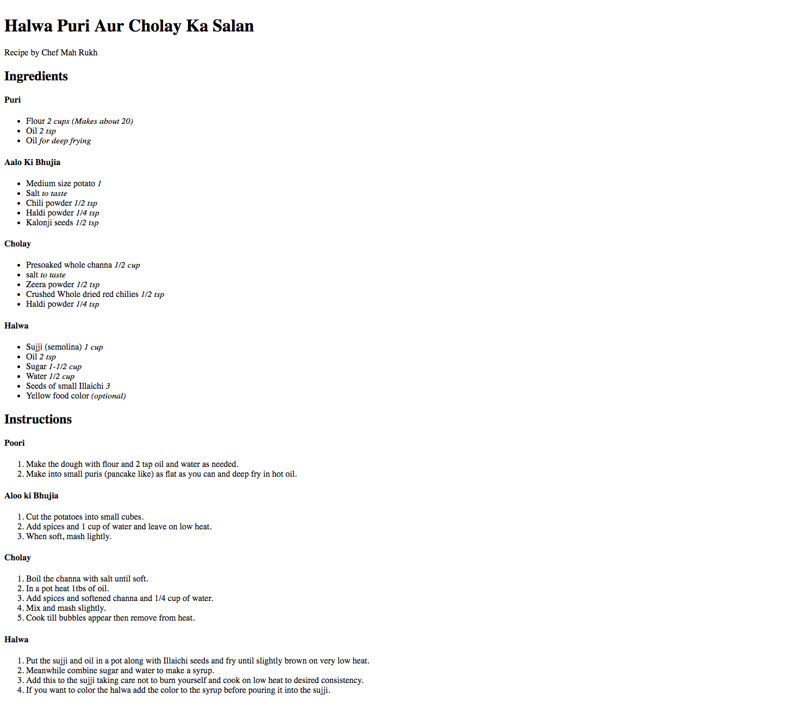

# Tech Karo - Recipe App

| **Powered By** Tech Karo  |

### Task ###
Create a Recipe app:
- Go to http://www.khanapakana.com/ and choose a recipe
- Create a web page of your chosen recipe. 
- Your recipe should have lists of:
    - Ingredients
    - Instructions
- Each ingredient quantity should be in italics

### What does it look like?

----

----

## Rules
1. Your app layout should look like the mockups attached in the `screenshots` folder.

-------------------
